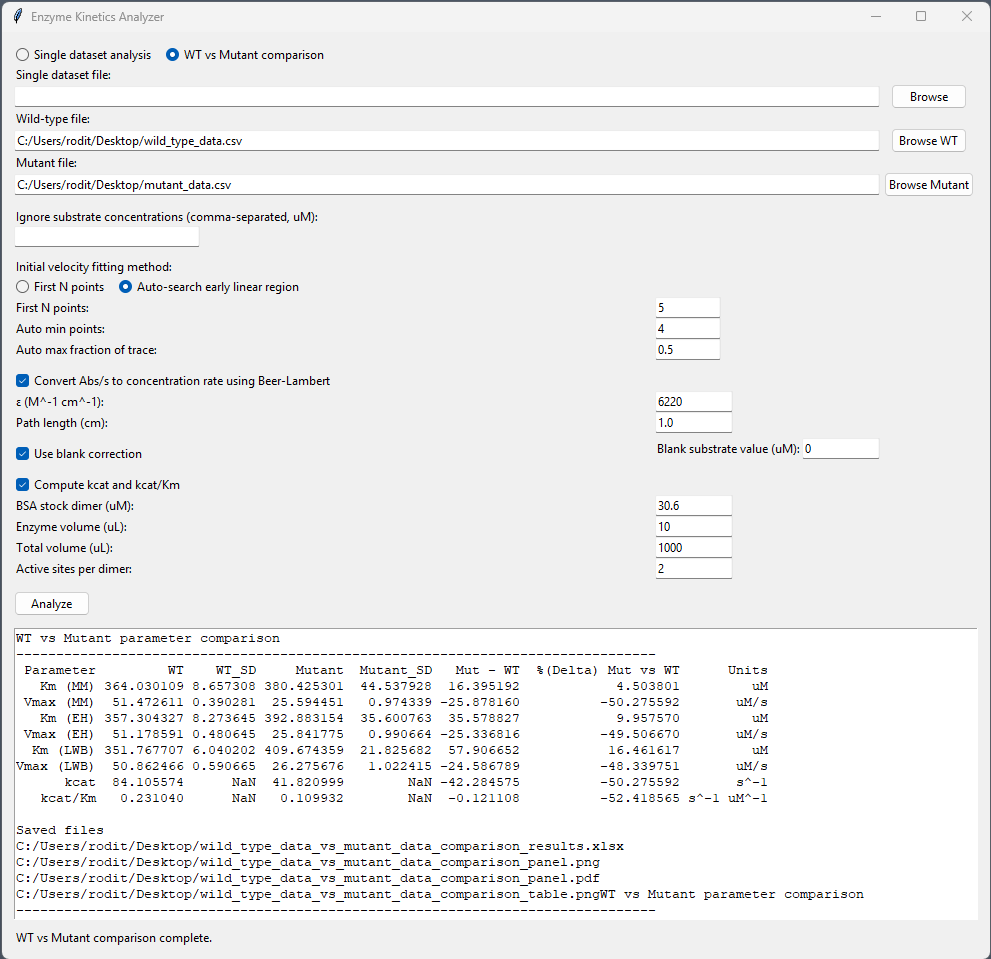
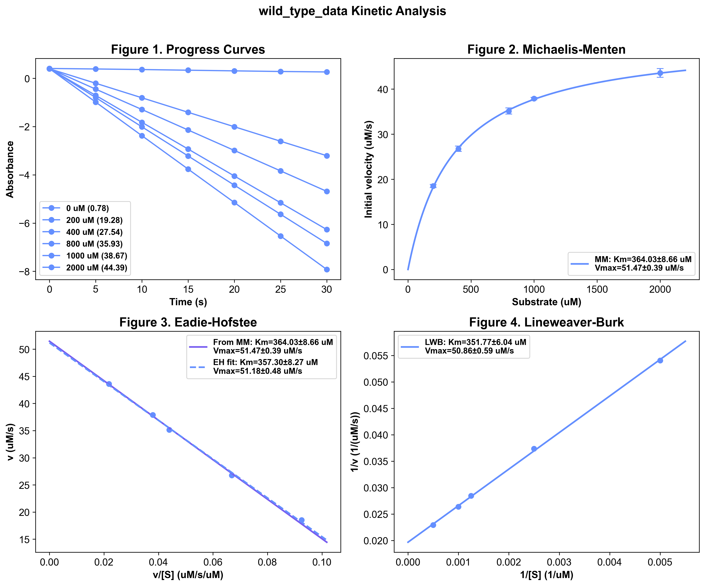
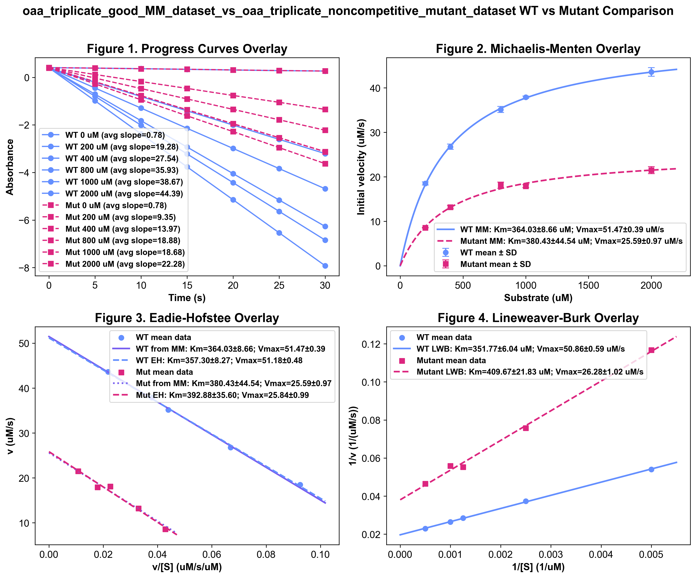
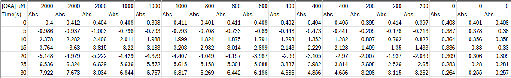

# enzyme-kinetics-analyzer
A student-friendly graphical tool for analyzing enzyme kinetics data, designed for undergraduate biochemistry and chemistry courses.

This application allows users to import raw absorbance data, determine initial velocities, and generate publication-quality plots for:

Michaelis–Menten kinetics
Eadie–Hofstee analysis
Lineweaver–Burk analysis

The tool emphasizes visual learning, data interpretation, and conceptual understanding rather than coding or software setup.
## Notebook Version (Colab)
Run directly in your browser:
[Open in Colab](https://colab.research.google.com/drive/1645xz2C725pUuXu2welgLP_-YoiuALPl#scrollTo=fWlkPfwc4FWk)

# Purpose
Students often struggle with:

extracting initial velocities
fitting kinetic models
interpreting multiple linearizations

This tool removes technical barriers so students can focus on:

understanding enzyme behavior
comparing wild-type vs mutant kinetics
connecting data to mechanism

# For Students (No installation required)
1. Download the latest release:
 Releases Page
2. Unzip the folder

3. Double-click:
EnzymeKineticsAnalyzer.exe

4. Load your data file and click Analyze

# Features
Import Excel or CSV data directly
Automatic detection of substrate concentrations
Handles replicate measurements (averaging + standard deviation)
Linear regression for initial velocity determination
Optional blank correction
## Interface

## Example Output
### Single Dataset Analysis

### WT vs Mutant Comparison

## Displays:
Km ± SD
Vmax ± SD
R² values

## Supports:
kcat and kcat/Km calculations
WT vs mutant comparison
Exports:
Figures (PNG + PDF)
Data tables (Excel)
Summary tables (PNG)

# Input Data Format (see example data)
See:
- examples/data/
- examples/results/
## Raw Data

Briefly:
First row: substrate concentrations (uM)
Second row: "Abs"
First column: time (s)
Replicates are automatically grouped by substrate concentration

# Educational Use
This tool is designed to support:

enzyme kinetics labs
CURE-based research courses
data analysis modules
visualization-based instruction

It pairs especially well with:

PyMOL or structural visualization
mutation or inhibitor analysis projects
discussions of enzyme mechanism and regulation

# Building the executable (Instructor Use)
To build the Windows executable:
1.Use a Windows machine
2. Run:
    build_windows_exe.bat
3. Distribute the folder inside:
    dist/EnzymeKineticsAnalyzer/
4. Students do not need Python installed.

# Open Educational Resource
This project is part of a broader effort to support:
  accessible, visualization-driven teaching in biochemistry

It aligns with my personal goals of the making science accessible and open educational practices.

# Citation/Attribution
If you use this tool in teaching or research, please cite:

Acevedo, R. et al. Enzyme Kinetics Analyzer: A Student-Centered Tool for Visualizing Enzyme Behavior (in preparation)

# Contributions
Suggestions, bug reports, and improvements are welcome!

# License
MIT License
